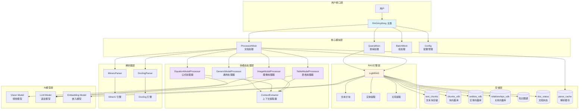
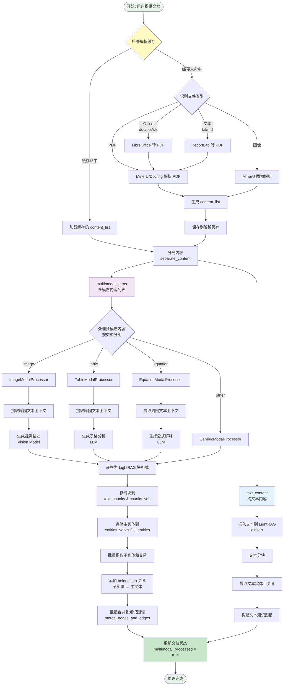
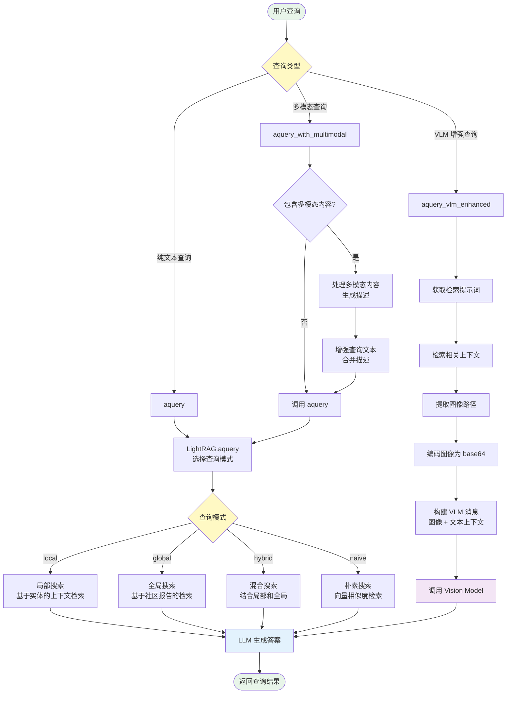
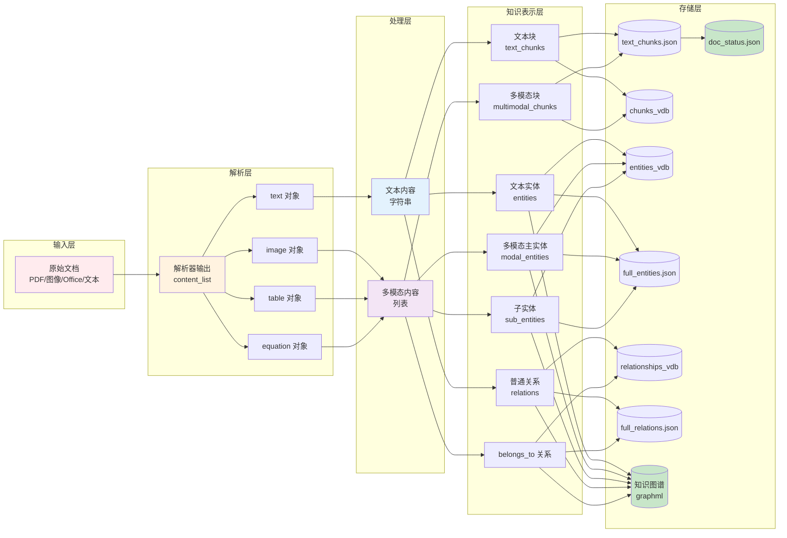
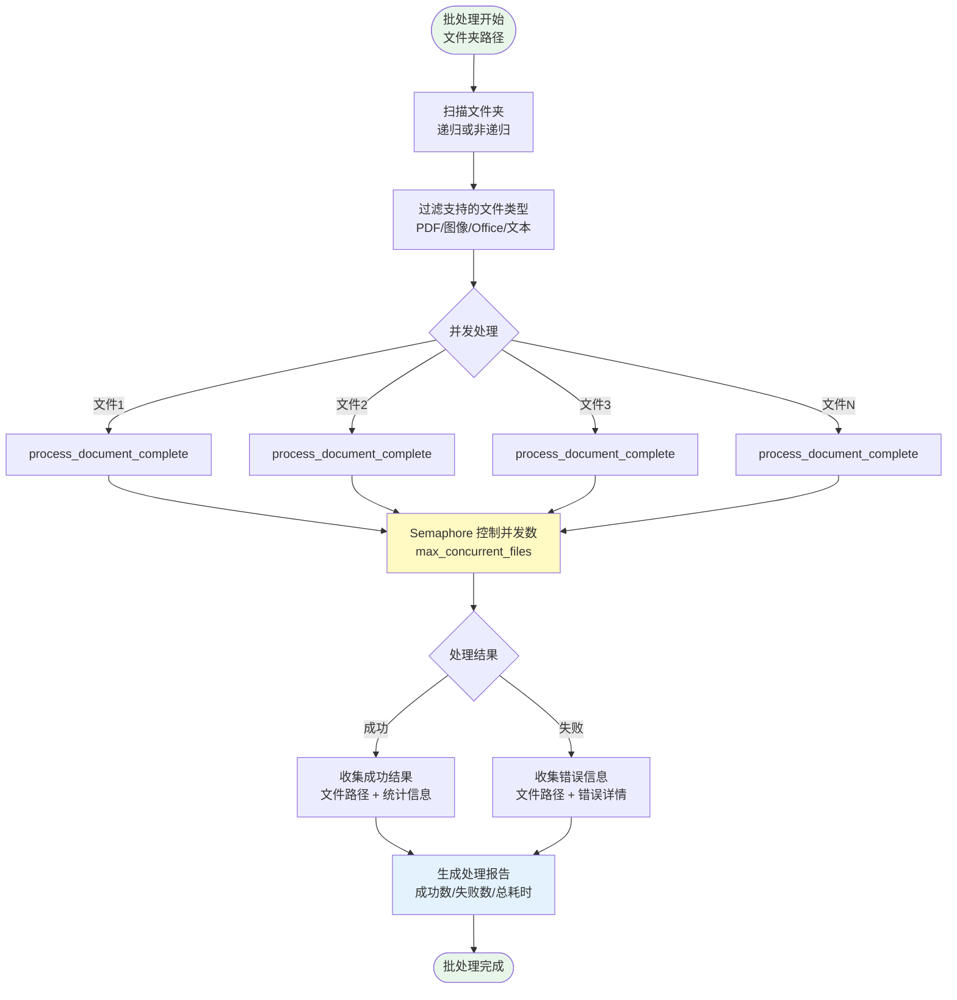
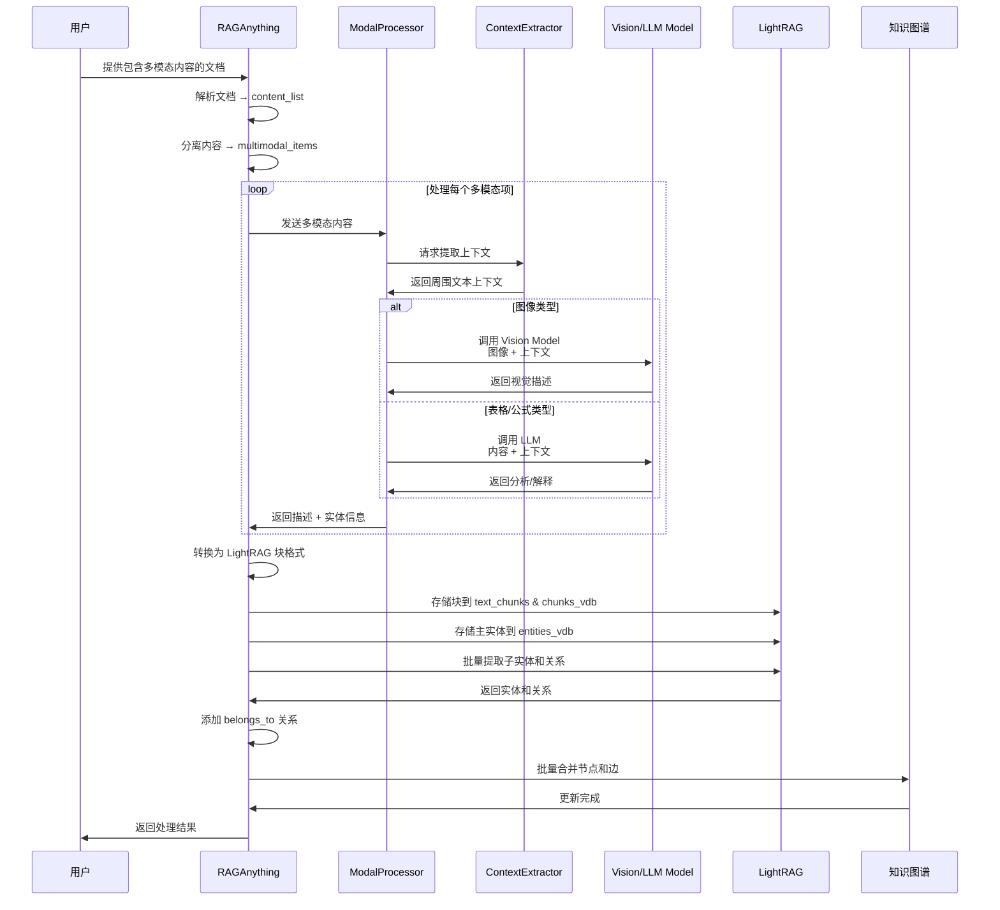
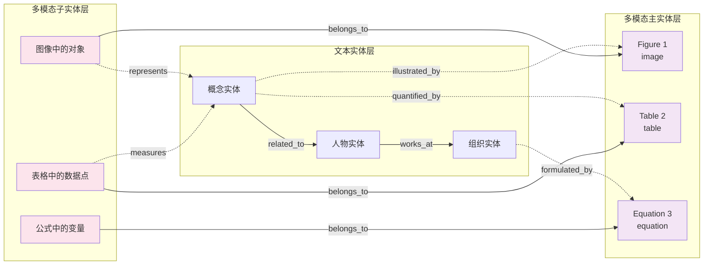
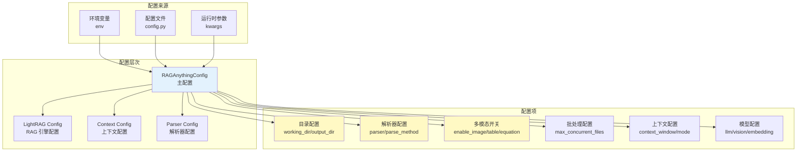
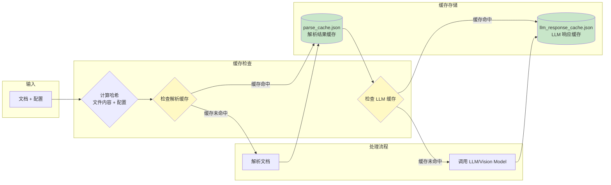

# RAG-Anything 项目架构流程图

## 整体架构概览

## 文档处理完整流程

## 查询流程架构

## 数据流架构

## 批处理流程

## 多模态内容处理详细流程

## 知识图谱结构

## 配置系统架构

## 缓存系统架构

## 项目关键技术点

### 1. Mixin 模式设计
- **QueryMixin**: 查询功能
- **ProcessorMixin**: 文档处理功能
- **BatchMixin**: 批处理功能
- **优势**: 模块化、可扩展、易维护

### 2. 多模态处理器架构
- **统一接口**: BaseModalProcessor
- **类型专用**: Image/Table/Equation/Generic
- **上下文感知**: ContextExtractor 提取周围文本
- **可扩展**: 易于添加新的模态处理器

### 3. 知识图谱结构
- **三层实体**: 文本实体 + 多模态主实体 + 子实体
- **关系类型**: 普通关系 + belongs_to 关系
- **双向链接**: 文本实体 ↔ 多模态实体

### 4. 缓存机制
- **解析缓存**: 基于文件内容 + 配置哈希
- **LLM 缓存**: LightRAG 内置
- **性能提升**: 避免重复解析和 API 调用

### 5. 批处理优化
- **并发控制**: Semaphore 限制并发数
- **进度显示**: tqdm 进度条
- **错误处理**: 收集和报告所有错误

### 6. 查询增强
- **VLM 集成**: 自动加载图像供 Vision Model 分析
- **多模态查询**: 支持查询时提供额外的多模态内容
- **混合模式**: 结合局部和全局检索

## 技术栈总结

| 层级 | 技术 | 用途 |
|------|------|------|
| **AI 模型** | OpenAI GPT-4/GPT-4V | LLM 和 Vision 推理 |
| **RAG 引擎** | LightRAG | 文本 RAG 和知识图谱 |
| **文档解析** | MinerU/Docling | 多模态文档解析 |
| **向量存储** | Nano Vector DB | 向量数据库 |
| **图存储** | NetworkX + GraphML | 知识图谱存储 |
| **并发处理** | asyncio + Semaphore | 异步并发控制 |
| **进度显示** | tqdm | 批处理进度条 |
| **配置管理** | 环境变量 + dataclass | 配置系统 |

## 项目优势

1. **全能多模态**: 统一处理文本、图像、表格、公式等
2. **上下文感知**: 处理多模态内容时考虑周围文本上下文
3. **高性能**: 缓存机制 + 批处理 + 并发处理
4. **易扩展**: Mixin 模式 + 插件式处理器架构
5. **用户友好**: 简洁 API + 详细文档 + 进度显示
6. **生产就绪**: 错误处理 + 日志记录 + 配置管理
